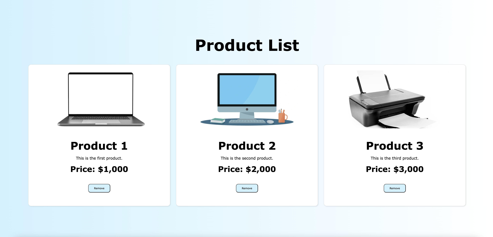
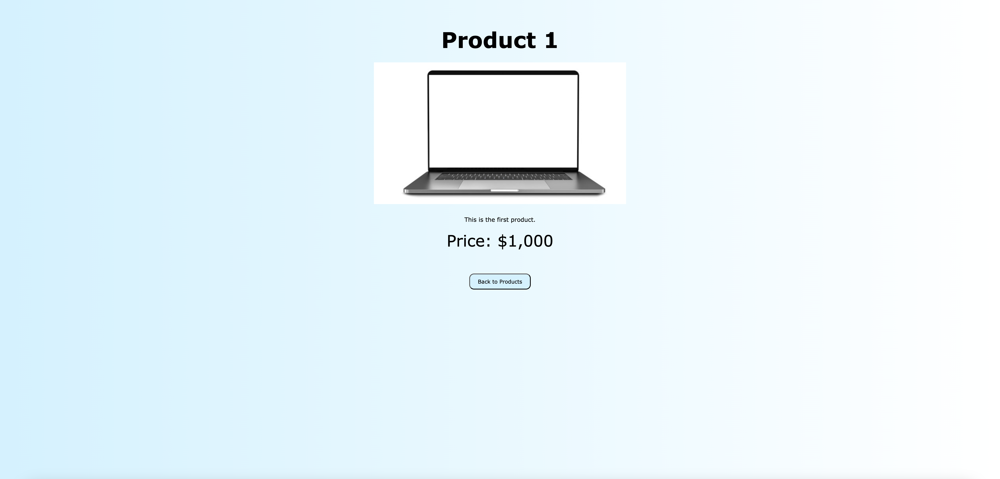

# Angular-Product-List
[](https://opensource.org/licenses/MIT)
## Table of Contents
* [Installation](#installation)
* [Description](#description)
* [Usage](#usage)
* [License](#license)
* [Credits](#credits)
* [Questions](#questions)

## Installation
To install, please follow these steps:

1. In Github, click the "Code" dropdown menu and copy the SSH URL.
2. Open your terminal and navigate to the directory you would like to clone this repository into.
3. Type "git clone paste-SSH-URL", replacing "paste-SSH-URL" with your copied SSH URL. You can substitute an SSH URL with an HTTPS URL.
4. Press enter to clone the repo to your local.
5. On your local, install Node.js if you haven't already with the following command:
   ```bash
   curl -o- https://raw.githubusercontent.com/nvm-sh/nvm/v0.39.5/install.sh | bash
   nvm install v16  # or a more recent stable version
6. Install the Angular CLI onto your system if you haven't already:
   ```bash
   npm install -g @angular/cli
7. Navigate to the project directory and install dependencies:
   ```bash
   npm install
8. Start the development server:
   ```bash
   ng serve
9. Once the server is running, open your browser and navigate to `http://localhost:4200/`.

## Description

This is a product list application built using Angular. The page displays all the sample products that are "for sale" with names, descriptions, and prices. The user can see a list of all products available, as well as a detail page for each individual product.

## Usage

On the main page, click the "More Information" button to see the detail page for a specific product.



On a detail page, click the "Back to Products" button to return to the main page.



## License
This project is licensed under the MIT License. For more information, please see the [MIT License](https://opensource.org/licenses/MIT).

## Credits
This program was created by Jacob McAuliffe.

## Questions
If you have further questions, you can reach me at [mcauliffemedia@gmail.com](mailto:mcauliffemedia@gmail.com).

GitHub Account: [jacobmca](https://github.com/jacobmca)

This project was generated using [Angular CLI](https://github.com/angular/angular-cli) version 19.1.7.

For more information on using the Angular CLI, including detailed command references, visit the [Angular CLI Overview and Command Reference](https://angular.dev/tools/cli) page.
